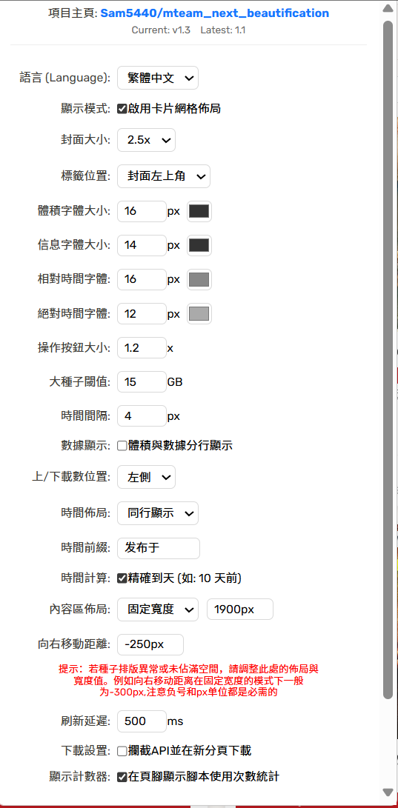

# M-Team 封面增強PRO (網格佈局、點擊放大、高級自定義)

一款為 M-Team (及類似站點) 瀏覽頁面量身打造的 Tampermonkey 用戶腳本，旨在將傳統列表轉換為現代、高度可自定義的卡片式網格佈局，顯著提升瀏覽體驗。

---

## 🚀 快速安裝與使用

### 步驟 1：安裝 Tampermonkey 擴展

首先，您需要在您的瀏覽器中安裝 Tampermonkey 擴展。

* **Chrome / Edge / Brave / Opera (Chromium 內核)**：[點擊這裡安裝](https://chrome.google.com/webstore/detail/tampermonkey/dhdgffkkebhmkfjojejmpbldmpobfkfo)
* **Firefox**：[點擊這裡安裝](https://addons.mozilla.org/zh-TW/firefox/addon/tampermonkey/)

### 步驟 2：安裝腳本

點擊下方鏈接，前往 **Greasy Fork** 安裝最新版本的腳本。

* **▶️ [點擊此處安裝 M-Team 封面增強PRO 腳本](https://greasyfork.org/zh-CN/scripts/541917-m-team-%E5%B0%81%E9%9D%A2%E5%A2%9E%E5%BC%B7pro-%E7%B6%B2%E6%A0%BC%E4%BD%88%E5%B1%80-%E9%BB%9E%E6%93%8A%E6%94%BE%E5%A4%A7-%E9%AB%98%E7%B4%9A%E8%87%AA%E5%AE%9A%E7%BE%A9)**

### 步驟 3：啟用與配置

1. 安裝完成後，刷新或打開 M-Team 的瀏覽頁面。
2. 腳本將自動啟用，頁面佈局會轉換為卡片網格模式。
3. 在頁面右上角的搜索框附近，您會看到一個新的「⚙️ 腳本設置」按鈕。
4. 點擊此按鈕即可打開配置面板，所有設置均可持久化保存，隨時調整以符合您的個人偏好。

> 推荐设置
>
> 

---

## ✨ 功能亮點介紹

### 核心佈局與視覺增強

* **卡片式網格佈局**：將傳統的表格數據轉化為美觀響應的卡片網格，提供更豐富的視覺體驗。
* **封面尺寸自由縮放**：根據您的屏幕分辨率和個人喜好，精確調整種子封面的顯示大小。
* **點擊封面放大**：點擊卡片封面圖片即可在彈出式燈箱中全屏放大查看，無需跳轉頁面。
* **🔥 【新增】免費種子視覺高亮**：自動識別帶有 `Free` 或 `免費` 標籤的種子，並以醒目的綠色邊框和陰影高亮顯示，助您快速發現優惠資源。
* **卡片懸停動畫**：鼠標懸停在卡片上時，圖片輕微放大，卡片上浮並伴隨陰影變化，增加交互動態感。

### 信息顯示優化

* **標籤位置靈活設置**：可選擇將種子標籤顯示在封面圖片左上角，或置於種子標題前方。
* **數據字體定制**：獨立控制種子體積、上傳/下載數、相對時間和絕對時間的字體大小和顏色，提升閱讀舒適度。
* **體積與數據分行顯示**：可選將種子體積與上傳/下載數據分開顯示到新行，使信息呈現更清晰。
* **上/下載數位置調整**：決定上傳/下載數據顯示在卡片底部信息區域的左側或右側。
* **時間顯示優化**：
  * **佈局選擇**：相對時間和絕對時間可選擇同行或換行顯示。
  * **時間前綴自定義**：為相對時間添加自定義前綴 (如“發佈於 ”)。
  * **精確時間計算**：啟用更精確的相對時間顯示 (如“10 天前”、“3 小時前”)。
  * **時間間隔調整**：控制相對時間和絕對時間之間的間距。

### 交互與功能性增強

* **收藏/下載按鈕即時同步**：卡片上的收藏和下載按鈕功能與原站點行為一致，並實時響應您的操作。
* **操作按鈕大小調整**：精確控制收藏和下載按鈕的縮放比例。
* **大種子高亮顯示**：設定一個可自定義的體積閾值，超過該體積的種子其體積數字會高亮顯示 (默認紅色)，便於快速識別大型資源。
* **下載連結新分頁打開**：腳本會攔截站點的下載 API 請求，強制將生成的下載連結在新瀏覽器分頁中打開，提供更流暢的下載體驗。

### 高度自定義與用戶體驗

* **內容區寬度自適應/固定**：靈活調整整個種子列表的內容區域寬度（最大寬度/固定寬度），並支持向右偏移，優化在不同顯示器上的佈局。
* **統一設置面板**：所有腳本功能設置均集成在一個直觀的彈出面板中，方便用戶隨時配置，所有設置持久化保存。
* **多語言支持**：目前支持繁體中文、簡體中文和英文，用戶可根據需要切換。
* **刷新延遲自定義**：可調整頁面內容更新（如分頁、篩選）時腳本重新渲染卡片佈局的延遲時間，優化性能與視覺平滑度。
* **腳本使用計數器**：可選擇在頁腳顯示腳本的匿名訪問統計。
* **一鍵重置所有設置**：提供便捷選項，將所有配置恢復為腳本默認值。

### 技術與維護

* **版本自動檢查**：腳本會自動檢查 GitHub 上的最新版本，並在設置面板中提示更新。
* **MIT 許可證**：腳本以開源形式發佈。

---

## ⚠️ 注意事項

* 此腳本主要針對 M-Team 的**新版 UI (2023年之後)**。在網站 UI 大幅更新時，腳本功能可能會受影響。
* 不保證在其他站點或 M-Team 的舊版 UI 上正常工作。
* 請確保您的瀏覽器和 Tampermonkey 擴展是最新版本，以獲得最佳兼容性。

## 🙏 鳴謝

本腳本的開發過程中得到了 **ChatGPT** 的強大 AI 輔助，特此感謝。

---
